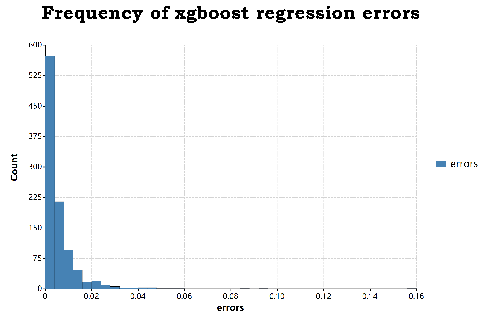

## Use this Machine Learning Package

```r
require(enigma);

imports ["learning", "model", "activateFunction"] from "enigma";
```

## Classification Example

Some examples of solve a classification problem, and inspect the dataset at first for the one class classification problem:

```r
data("bezdekIris");

print(dataset::description(bezdekIris));
#                D1         D2         D3         D4            class
# --------------------------------------------------------------------
# <mode>   <double>   <double>   <double>   <double>         <string>
# min           4.3          2          1        0.1    "Iris-setosa"
# max           7.9        4.4        6.9        2.5 "Iris-virginica"
# width         3.6        2.4        5.9        2.4              "3"
# mean      5.84333    3.05733      3.758    1.19933    "Iris-setosa"
# sd      0.0676113  0.0355883   0.144136  0.0622364             "NA"
# rsd     0.0115707  0.0116403  0.0383544  0.0518925             "NA"

rownames(bezdekIris) = unique.names(bezdekIris$class);

data = bezdekIris 
|> toFeatureSet() 
|> dataset::encoding(class = to_factors) 
|> as.data.frame()
;
#                     D1       D2       D3       D4 class.Iris-setosa class.Iris-versicolor class.Iris-virginica
# ---------------------------------------------------------------------------------------------------------------
# <mode>        <double> <double> <double> <double>         <integer>             <integer>            <integer>
# Iris-setosa        5.1      3.5      1.4      0.2                 1                     0                    0
# Iris-setosa_1      4.9        3      1.4      0.2                 1                     0                    0
# Iris-setosa_2      4.7      3.2      1.3      0.2                 1                     0                    0
# Iris-setosa_3      4.6      3.1      1.5      0.2                 1                     0                    0
# Iris-setosa_4        5      3.6      1.4      0.2                 1                     0                    0
# Iris-setosa_5      5.4      3.9      1.7      0.4                 1                     0                    0

#  [ reached 'max' / getOption("max.print") -- omitted 144 rows ]

i = data[, "class.Iris-setosa"] == 1;
v = rep("", length(i));
v[i] = "Iris-setosa";
v[!i] = "Other";

data[, "class.Iris-setosa"] = v;
```

For use the svm classifier:

```r
tensor(model = model::svm)
|> feed(data, features = ["D1","D2","D3","D4"])
|> output(labels = ["class.Iris-setosa"])
|> learn()
|> solve(data)
;
```

For use the xgboost classifier:

```r
tensor(model = model::xgboost)
|> feed(data, features = ["D1","D2","D3","D4"])
|> output(labels = ["class.Iris-setosa"])
|> learn()
|> solve(data)
;
```

For use the ANN classifier, then you could:

```r
tensor(model = model::ANN)
|> feed(data, features = ["D1","D2","D3","D4"])
|> hidden_layer([50, 500, 5], activate = activateFunction::sigmoid(alpha = 2.0))
|> output(
    labels = ["class.Iris-setosa","class.Iris-versicolor","class.Iris-virginica"], 
    activate = activateFunction::sigmoid(alpha = 2.0)
)
|> learn(parallel = TRUE)
|> solve(data)
```

## Regression Example

By first of all, we prepares an example demo dataset for such regression modelling problem like:

```r
# generate the demo test dataset
let x = 1:1000;
let y = x ^ 1.25 + runif(n = length(x));
let z = y / x;

data = data.frame(x, y, z, row.names = as.character(x));
#                x        y        z
# -----------------------------------
# <mode> <integer> <double> <double>
# 1              1  1.99925  1.99925
# 2              2  3.34409  1.67205
# 3              3  4.40403  1.46801
# 4              4   5.8122  1.45305
# 5              5   7.9491  1.58982
# 6              6  10.1006  1.68343

#  [ reached 'max' / getOption("max.print") -- omitted 994 rows ]
```

The some of the example for solve the regression problem by use the ``enigma`` package:

### 1. xgboost regession 

```r
test = tensor(model = model::xgboost)
|> feed(data, features = ["x", "y"])
|> output(labels = "z")
|> learn(loss = "squareloss", cost = "mse")
|> solve(data)
;

test[, "errors"] = abs(test$z - test[, "z(predicts)"]);
i = order(test$errors);
test = test[i, ];
#                x        y        z z(predicts)       errors
# ------------------------------------------------------------
# <mode> <integer> <double> <double>    <double>     <double>
# 918          918  5053.48  5.50488     5.50487  3.06194E-06
# 696          696  3574.91  5.13637     5.13636  5.30553E-06
# 607          607  3012.96   4.9637     4.96369  7.10683E-06
# 826          826  4428.27  5.36111     5.36112  1.16761E-05
# 810          810  4322.19  5.33603     5.33604  1.23223E-05
# 879          879  4786.52  5.44542     5.44543  1.36714E-05

#  [ reached 'max' / getOption("max.print") -- omitted 994 rows ]
```

### 2. SVR regression

For solve a SVR regression problem, then we could just replace the tensor model to ``svr`` function:

```r
test = tensor(model = model::svr)
|> feed(data, features = ["x", "y"])
|> output(labels = "z")
|> learn()
|> solve(data)
;
```

### Visual Regression Test Error



```r
data[, "errors"] = abs(data$z.predicts. - data$z);

print(data, max.print =6);

bitmap(file = file, size = [2700, 1800]) {
    ggplot(data, aes(x = "errors"), padding = "padding:250px 400px 200px 250px;")
    + geom_histogram(bins = 250, color = "steelblue", range = [0, 1])
    + ggtitle(title)
    + scale_x_continuous(labels = "F2")
    + scale_y_continuous(labels = "F0")
    + theme_default()
    ;
}
```